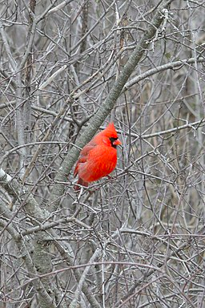
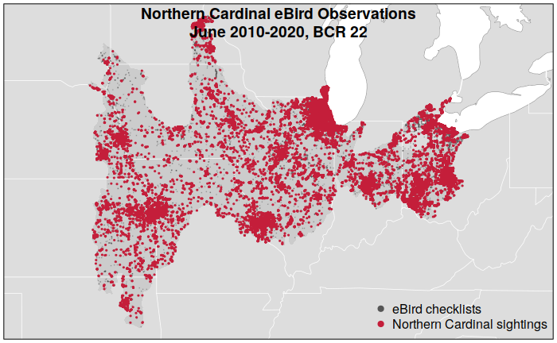
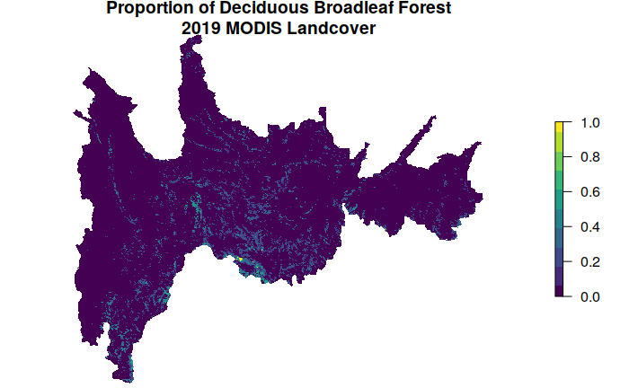
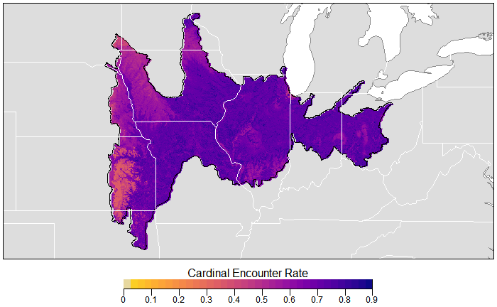
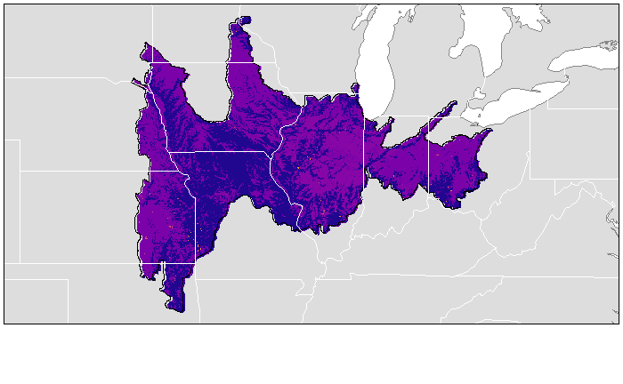
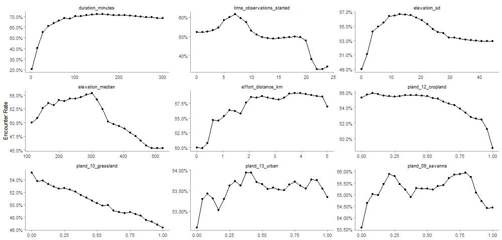
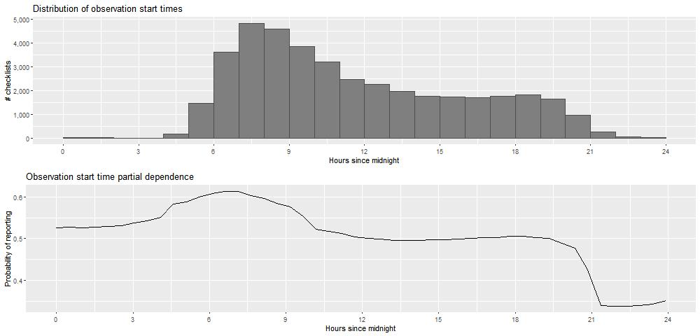
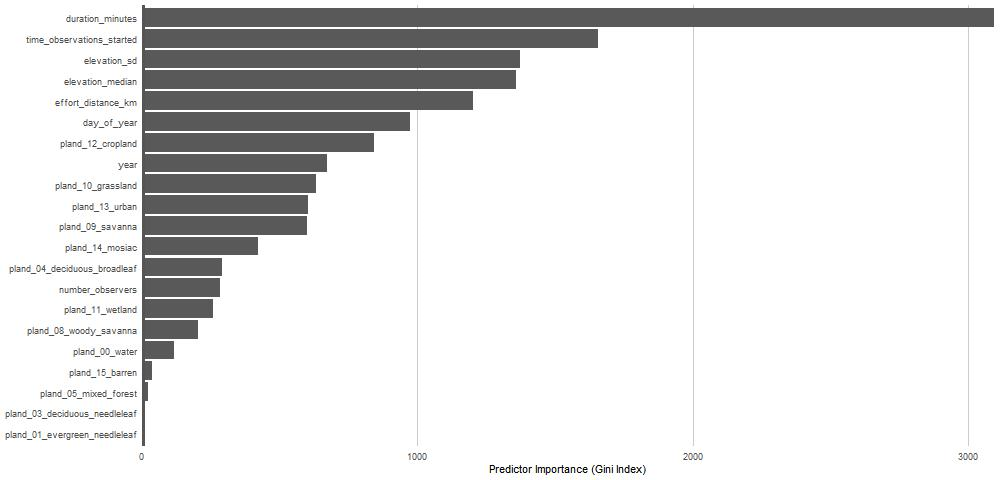
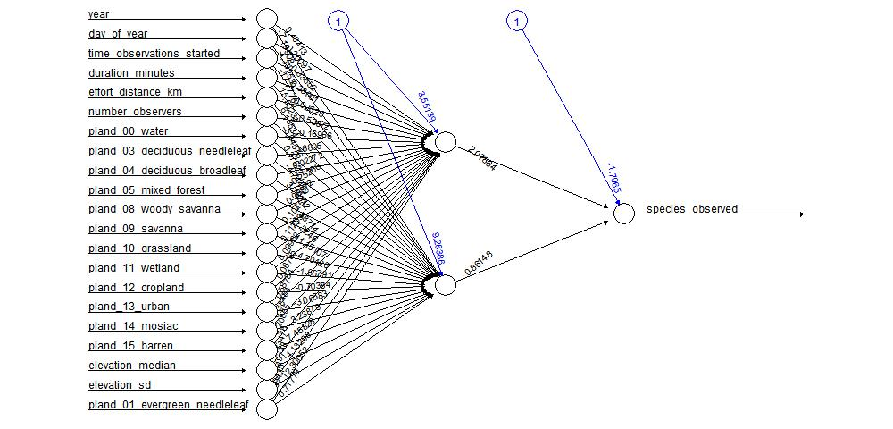

\newpage

# Abstract 
The eBird dataset from Cornell Lab of Ornithology represents millions of bird observations from citizen scientists and ornithologists. This rich set of labeled data, combined with publicly available geographic information system (GIS) information has many applications in biology and computational ornithology.  Building from the data preparation and random forest for predicting species encounter rates example in the Best Practices for Using eBird Data guide, we modeled with Support Vector Machines (SVM) and Advanced Neural Network (ANN) and compared the results.  For the Northern Cardinal in the Eastern Plains Region, random forest produced the most accurate results, with ANN slightly worse.  SVM both produced the lowest accuracy and slowest performance.

# Introduction

Bird watching or birding is a recreational pastime that allows people to spend time in nature, appreciate the natural world around them, and engage in citizen science. Looking at birds is a very old activity that has recently gained attention as a cheap hobby growing among millennials (McIntyre, 2019) and as an appropriately socially distant outlet during the COVID-19 pandemic (Flaccus). The Cornell Lab of Ornithology provides online and mobile tools for birders to record their sightings. The aggregated data from hobbyists combined with data collected by ornithologists and conservationists fuels the growing field of [computational ornithology](https://www.birds.cornell.edu/home/center-for-avian-population-studies/). Uses for the data range from powering "hotspot" lists to inform birders on where to go to important biological findings such as the loss of 3 billion birds since 1970 (Rosenberg, 2019).

The checklists entered into the eBird app and website are made available by request as the eBird database. This data, combined with GIS data including land cover and elevation, were used to predict likelihood of encountering a bird in a given location.

We chose to model the likelihood of encountering a Northern Cardinal in the Eastern Plains bird conservation region (BCR), which contains Chicago. Cardinals are common and recognizable as well as being regarded as interesting or pretty birds: we believed that we would have a large number of accurate checklists documenting the presence of this particular species. The [Best Practices for Using eBird Data](https://cornelllabofornithology.github.io/ebird-best-practices/index.html) guide, written for Cornell Lab of Ornithology, provides detailed instructions on preparing data for a random forest for prediction species observation. This allowed us to explore a dataset in a domain previously unknown to us to compare multiple statistical learning modeling methods.

# Data sources

Following the guidance of the eBird Best Practices, we gathered [bird conservation region boundaries](https://nabci-us.org/resources/bird-conservation-regions/), [bird observation data](https://ebird.org/science/download-ebird-data-products), Moderate Resolution Imaging Spectroradiometer (MODIS) [land cover data](https://lpdaac.usgs.gov/products/mcd12q1v006/), [elevation data](http://www.earthenv.org/topography), and used the [Geospatial Data Abstraction Library](https://gdal.org/) (GDAL) software library.

To quote the North American Bird Conservation Initiative (NABCI) directly, "[Bird Conservation Regions (BCRs) are ecologically distinct regions in North America with similar bird communities, habitats, and resource management issues](https://nabci-us.org/resources/bird-conservation-regions/)." The Eastern Plains, region 22, was chosen due our connections to the Chicagoland area.

The eBird data contains information on each checklist with a bird sighting including the number of people observing, the distance traveled during observation, time duration, and datetime. We requested and received an extract subsetted for our chosen species and within the United States. Figure 2 illustrates the location of all reported Northern Cardinal sightings in our region of interest over a ten year span.

The land cover data makes up the largest number of our features available for modeling, measures of land cover (urban, water, deciduous broadleaf forest, grassland, etc.) in a particular area. For example, we see in Figure 3 that there is very little deciduous broadleaf forest in the region.

# Methodology

The [eBird Best Practices](https://cornelllabofornithology.github.io/ebird-best-practices/intro.html) tutorial includes detailed instructions for building and calibrating a random forest classifier, using the features related to the checklists, the habitat, and the elevation to predict whether or not a Cardinal is observed. This provides a large volume of labeled data for which supervised statistical learning methods are ideal.

We wished to begin by building the model as instructed for our own chosen bird species and region and then use an alternative method and compare the results. As our goal is a single classification of True or False, support vector machines were an appropriate choice. A neural network was our third model for comparison.

## Random Forest

Random forest is a flexible, easy to use machine language algorithm that produces great results even without hyperparameter tuning. It is also one of the most used algorithms, because of its simplicity and diversity as it can be used for both classification and regression tasks. To understand what random forest is one must understand what a decision tree is. A decision tree is a flowchart-like structure in which each internal node represents a test on an attribute, each branch represents the outcome of the test, and each leaf node represents a class label. The paths from root to leaf represent classification rules. (Donges, 2019)

Random forests is a collection of a large number of individual decision trees that operate in an ensemble. Each tree in the random forest gives a class prediction and the class with the most votes becomes the model prediction. The basic idea behind random forest is that a large number of relatively uncorrelated decision trees will outperform any of the individual trees. (Yiu, 2019)

## Artificial Neural Networks

Artificial Neural Networks (ANN) is a supervised learning system built of a large number of simple elements, called neurons or perceptrons. Each neuron can make simple decisions, and feeds those decisions to other neurons, organized in interconnected layers. Together, the neural network can emulate almost any function, and answer practically any question, given enough training samples and computing power. A neural network has only three layers of neurons, An input layer that accepts independent variables, hidden layers and an output layer that generates predictions. Neural networks are accurate and improve in accuracy as more hidden layers and neurons are added.

After a neural network is defined with initial weights, and a forward pass is performed to generate the initial prediction, there is an error function which defines how far away the model is from the true prediction.There are many possible algorithms that can minimize the error function. However, for large neural networks, a training algorithm is needed that is very computationally efficient. Backpropagation is that algorithm. It can discover the optimal weights relatively quickly, even for a network with millions of weights.the backpropagation algorithm calculates how much the output values are affected by each of the weights in the model. To do this, it calculates partial derivatives, going back from the error function to a specific neuron and its weight. This provides complete traceability from total errors, back to a specific weight which contributed to that error. The result of backpropagation is a set of weights that minimize the error function.weights can be updated after every sample in the training set, but this is usually not practical. Typically, a batch of samples is run in one big forward pass, and then backpropagation performed on the aggregate result. The batch size and number of batches used in training, called iterations, are important hyperparameters that are tuned to get the best results. Running the entire training set through the backpropagation process is called an epoch. (MissingLink, 2019)

The output of each neuron is determined by the activation function. An activation function is a mathematical equation that determines the output in the neural network. It takes the input from each neuron and transforms it into an output between one and zero or -1 and 1. Common activation functions used in neural networks are sigmoid and tanh. In neural networks, inputs are fed into neurons in the network. In each neuron, the input value is multiplied by the weight and fed into the activation function; each neuron's output is fed into the input of the neuron in the next layer and the process is repeated until the output layer generates a prediction (MissingLink, 2019.)

On a technical level, one of the bigger challenges is the amount of time it takes to train networks, which can require a considerable amount of compute power for more complex tasks. The biggest issue, however, is that neural networks are "black boxes," in which the user feeds in data and receives answers. They can fine-tune the answers, but they don't have access to the exact decision making process. (Dormehl, 2019)

## Support Vector Machines

Support vector machines are used both in supervised and unsupervised machine learning. Developed for handwriting recognition in the 1990s at AT&amp;T Bell Labs, SVMs make use of kernel methods and are applied today in classification, regression, and novelty detection (Bennett, 2000. Of note for this project, SVMs are used for identifying bird species by audio recordings of their calls (Fagerlund, 2007).

Training data is used to construct a hyperplane--a flat affine subspace of dimension n-1, where the space is n-dimensional--to separate classes (James, 2013, p 338). Optimizing to hyperplane which has the furthest minimum distance to the training the data produces maximal margin classifier (James, 2013, p 341). Where the data is not linearly separable, another kernel function can be chosen to measure the distance of the data from this boundary. One of the advantages of SVMs is that if the data is not separable, either linearly or by another kernel, a soft margin can be used, allowing for misclassifications. To save on computation resources, SVM makes use of the kernel trick: rather than calculating the coordinates in a high dimensional space, inner products of images of pairs of data are taken (Hastie, 2001, p, 423).

# Data Preparation

The data was prepared according to the eBird Best Practices document. Rather than using the Wood Thrush in the Southeastern Coastal Plain region, we obtained data and filtered accordingly for the Northern Cardinal and the Eastern Plains region.

The result of the data preparation resulted in a dataset with True or False for whether the Cardinal was observed with 21 observation variables (see appendix for full list). Our dataset includes observations for the month of June in Eastern Plains BRC as seen in Figure 2.

Challenges arose in working with the GIS data, both obtaining packages for our OS and with version conflicts in R packages. We would recommend that anyone wishing to work with this data allot significant time for setup and be willing to upgrade or downgrade R versions as needed. The challenges also differed by OS and with one team member using Ubuntu Linux and the other Windows, solutions that worked for one often did not resolve problems for the other.

There were approximately 50,000 relevant checklists. Initially, we modeled using the full set but due to the resource constraints of our laptops, we reduced down to a random set of 10,000 checklists using the _createDataPartition_ function.

# Analysis and Results

Before we started modelling we had to deal with three challenges faced when using the ebird data which are spatial bias, temporal bias and class imbalance. Spatial and temporal bias means that the eBird checklists tend to be distributed non-randomly in space and time, while class imbalance refers to the fact that there will be many more non-detections than detections for most species. These can impact our ability to make reliable inferences. To deal with these issues we subsampled the data prior to modelling as done in the ebird data best practice tutorial. We subsampled the data by defining an equal area on a hexagonal grid across the region and then subsample detections and non-detections separately to ensure we don't lose too many observations. To do the hexagonal grid, we used the package "dggridR" which makes it simple and efficient. It must be noted that, there were some problems with the "dggridR" package as it has to be compatible with the Gdal version that is being used or there will be errors. The subsampling decreased the overall number of checklists but increased the prevalence of detections. This increase in detections will help the models distinguish where birds are being observed better.(Strimas-Mackey,2020)

## Random Forest Model

The random forest model was used to relate detected/non-detected cardinal to the habitat covariates which are MODIS land cover and elevation while accounting for variation which arises due to the inclusion of the effort covariates. The "ranger" package was used to model the random forest model as it is a fast implementation with all the features that was needed for this project. In the random forest model parameters, we used "replace = true" to ensure bootstrap sample and "probability = true" to get the probabilities from the predictions which are needed in the plot. On analysis the predicted probabilities did not align with the observed frequencies so after training the model, the model was calibrated to improve the performance of the model. The encounter rate for each checklist was predicted and the was fit with a General Additive Model (GAM) with the real observation encounter rate. This was done with the help of the "scam" package so that the shape can be monotonically increased. The original random forest model was as good as the calibrated model with similar MSE, sensitivity and specificity so the original random forest was used for the next step. From the random forest model, the important predictors were gathered according to the Gini index and the partial dependence for every important predictor was calculated and plotted versus the encounter rate. With the help of these partial dependencies, the peak time of day was calculated. (Strimas-Mackey,2020)

The next step was to add the effort covariates which included the year, day of the year, time observation started which is the peak time of day in or case, duration of observation, distance and number of observations, to the prediction surface that was generated in the project setup and random forest was used to predict probabilities with the new prediction surface. Once the prediction was complete, the probability values were added back into the prediction surface data which were converted to spatial features and used to project and plot Figure 4.

## Artificial Neural Networks

Artificial neural networks was also one of the models used in this project. To use ANN, the data used to train the model was first scaled. After scaling the data, a simple ANN structure with only one hidden layer with two nodes in it set to give probabilities as output. The next step was to predict the probabilities using the data which contains the prediction surface with effort variables as new data. From there, the predictions were added to the prediction surface data and converted to spatial features which were used to project and plot Figure 5.

## Support Vector Classification

For the support vector machine classifier, we used the e1071 package. With a linear kernel, we used the built in _tune_ function to test three costs: .1, 1, and 5. A cost of 5 produced the smallest error. Using this as our svm model, we predicted species observation and analyzed our error rates, seen in the table below. Feature importance is not returned by _svm_ models in e1071.

### Model Summary
| Call | svm(formula = species\_observed ~ ., data = train, type = "C-classification", kernel = "linear", cost = 5, probability = TRUE) |
| --- | --- |
| Parameters | SVM-Type: C-classification SVM-Kernel: linear cost: 5 |
| Number of Support Vectors | 6228 |
| Number of Classes | 2 |
| Levels | FALSE, TRUE |

Table 1: Model summary of SVM

# Conclusion

## Model Comparison

| **Model** | **Package Used** | **Parameters** | **Test MSE** | **Sensitivity** | **Specificity** |
| --- | --- | --- | --- | --- | --- |
| **Random Forest** | ranger | Ntree = 500, mtry = 4 | 0.198 | 0.7577 | 0.6059 |
| **Neural Network** | neuralnet | Hidden = 2, threshold = 0.1 | 0.208 | 0.7707 | 0.5985 |
| **Support Vector Classifier** | e1071 | Linear kernel,C-classification type,Cost = 5 | 0.340 | 0.6140 | 0.7173 |

Table 2: Summary of key model statistics

Random forest was far and away the fastest of the three methods. Had we used with this alone model, we could have proceeded with the full dataset of around 50,000 observations. Random forest also produced the lowest test MSE and had the highest sensitivity. It's specificity was the worst, but false positives are not of great concern in our problem: this model may incorrectly suggest that an observer will see a Northern Cardinal. This is a very common bird in the region, so an observer is unlikely to need to go to great lengths to see one and unlikely to be very disappointed if they do not see a Cardinal.

The ANN achieved similar results to the random forest and was the middle performer for completion time. If, for a particular application, Sensitivity were more important than the test MSE, ANN would be an appropriate model to choose over random forest.

SVM was both the slowest and the worst performing on both test MSE and Sensitivity.

## Further Exploration

Without reducing the size of the sample, using _tune_ in the svm package ran for more than 12 hours on a laptop using only 3 cost parameters. This was prohibitive, so we moved ahead with a 10,000 row sample of the data. Given more resources, running with the full data set would likely produce a more accurate model. With additional time, more kernels could be used in SVM models, allowing greater optimization of this, the worst performing of the three models.

Having gained familiarity with the data and invested time into getting the GIS tools to work, there are further opportunities to explore. More complex models, such as [SpatioTemporal Exploratory Models](https://reader.elsevier.com/reader/sd/pii/S187802961100137X?token=E9202FA883703696BBAA27C24E2E9BCE64368617A877748BF45060001F8E22EFC68D13A273497A78C9DE91342A103CE2) (STEM) and [Adaptive SpatioTemporal Exploratory Models](https://www.cs.cornell.edu/~damoulas/Site/AdaSTEM_files/AdaSTEM.pdf) (ADA STEM), would include the seasonality element, where our work was limited to the month of June.

# Bibliography

## Resources

1. Bennett, K., and Campbell, K. 2000. "[Support vector machines: hype or hallelujah?](https://www.kdd.org/exploration_files/bennett.pdf)" _SIGKDD Explor. Newsl._ 2, 2 (Dec. 2000), 1–13. DOI:https://doi.org/10.1145/380995.380999
2. Boser, B., Guyon, I., and Vapnik, V.. 1992. "[A training algorithm for optimal margin classifiers](http://citeseerx.ist.psu.edu/viewdoc/download?doi=10.1.1.21.3818&amp;rep=rep1&amp;type=pdf)." In _Proceedings of the fifth annual workshop on Computational learning theory_ (_COLT '92_). Association for Computing Machinery, New York, NY, USA, 144–152. DOI:https://doi.org/10.1145/130385.130401
3. Fagerlund, S. (2007). Bird species recognition using support vector machines. _EURASIP Journal on Advances in Signal Processing_, _2007_(1), 038637
4. Fink, D., Damoulas, T., &amp; Dave, J. (2013). "[Adaptive Spatio-Temporal Exploratory Models: Hemisphere-wide species distributions from massively crowdsourced eBird data](https://www.cs.cornell.edu/~damoulas/Site/AdaSTEM_files/AdaSTEM.pdf)." AAAI 2013, Washington, USA.
5. Fink, D., Hochachka, W. M., Zuckerberg, B., Winkler, D. W., Shaby, B., Munson, M. A., ... &amp; Kelling, S. (2010). "[Spatiotemporal exploratory models for broad‐scale survey data](https://reader.elsevier.com/reader/sd/pii/S187802961100137X?token=E9202FA883703696BBAA27C24E2E9BCE64368617A877748BF45060001F8E22EFC68D13A273497A78C9DE91342A103CE2)". _Ecological Applications_, _20_(8), 2131-2147.
6. Flaccus, G. "[Bird-watching soars amid COVID-19 as Americans head outdoors](https://apnews.com/article/94a1ea5938943d8a70fe794e9f629b13)." Associated Press.
7. James, G., Witten, D., Hastie, T., Tibshirani, R. _An Introduction to Statistical Learning : with Applications_ in R. New York: Springer, 2013.
8. Hastie, T.,Tibshirani, R., and Friedman, J. _The Elements of Statistical Learning: Data Mining, Inference, and Prediction. Second Edition._ Springer Series in Statistics Springer New York Inc., New York, NY, USA, (2001)
9. North American Bird Conservation Initiative, [https://nabci-us.org/resources/bird-conservation-regions/](https://nabci-us.org/resources/bird-conservation-regions/). Accessed: December 4th, 2020.
10. Photo by [Ryan Hodnett](https://commons.wikimedia.org/wiki/File:Northern_Cardinal_(Cardinalis_cardinalis),_Male_-_Cambridge,_Ontario_2019-02-09_(02).jpg), [CC BY-SA 4.0](https://creativecommons.org/licenses/by-sa/4.0), via Wikimedia Commons
11. Strimas-Mackey, M., W.M. Hochachka, V. Ruiz-Gutierrez, O.J. Robinson, E.T. Miller, T. Auer, S. Kelling, D. Fink, A. Johnston. 2020. Best Practices for Using eBird Data. Version 1.0.[https://cornelllabofornithology.github.io/ebird-best-practices/](https://cornelllabofornithology.github.io/ebird-best-practices/). Cornell Lab of Ornithology, Ithaca, New York.[https://doi.org/10.5281/zenodo.3620739](https://doi.org/10.5281/zenodo.3620739)
12. Rosenberg, K., Dokter, A., Blancher, P., Sauer, J., Smith, A., Smith, P., Stanton, J., Panjabi, A., Helft, L., Parr, M., Marra P. "[Decline of the North American avifauna](https://science.sciencemag.org/content/366/6461/120/suppl/DC1)" _Science_ 04 Oct 2019 : 120-124
13. McIntyre, C. "[The rise of millennial, urban-dwelling birders](https://www.macleans.ca/society/the-rise-of-millennial-urban-dwelling-birders/)." _Macleans._ July 27, 2017
14. Pennisi, E. "Three billion North American birds have vanished since 1970, surveys show." [_www.sciencemag.org/_](http://www.sciencemag.org/) Sep. 19, 2019 , 2:00 PM
15. Peixiero, M., "[The Complete Guide to Support Vector Machine (SVM)](https://towardsdatascience.com/the-complete-guide-to-support-vector-machine-svm-f1a820d8af0b)." _Towards Data Science_. Jul 29, 2019
16. Frankenfield, J. (2020, Aug 28). _Artificial Neural Network (ANN)_. Investopedia. https://www.investopedia.com/terms/a/artificial-neural-networks-ann.asp
17. Dormehl, L. (2019, jan 6). _What is an artificial neural network? Here's everything you need to know_. Digitaltrends. https://www.digitaltrends.com/cool-tech/what-is-an-artificial-neural-network/
18. Marr, B. (2018, Sep 24). _What Are Artificial Neural Networks - A Simple Explanation For Absolutely Anyone_. Forbes. https://www.forbes.com/sites/bernardmarr/2018/09/24/what-are-artificial-neural-networks-a-simple-explanation-for-absolutely-anyone/?sh=63af95a11245
19. MissingLink. (2019, Mar 1). _The Complete Guide to Artificial Neural Networks: Concepts and Models_. Neural Network Concepts. [https://missinglink.ai/guides/neural-network-concepts/complete-guide-artificial-neural-networks/](https://missinglink.ai/guides/neural-network-concepts/complete-guide-artificial-neural-networks/)
20. Donges, N. (2019, June 16). _A COMPLETE GUIDE TO THE RANDOM FOREST ALGORITHM_. Bulitin. [https://builtin.com/data-science/random-forest-algorithm](https://builtin.com/data-science/random-forest-algorithm)
21. Yiu, T. (2019, June 12). _Understanding Random Forest_. Towardsdatascience. https://towardsdatascience.com/understanding-random-forest-58381e0602d2

## Datasets

1. [Amatulli, G., Domisch, S., Tuanmu, M.-N., Parmentier, B., Ranipeta, A., Malczyk, J., and Jetz, W. (2018) A suite of global, cross-scale topographic variables for environmental and biodiversity modeling. Scientific Data volume 5, Article number: 180040. DOI: doi:10.1038/sdata.2018.40](https://www.nature.com/articles/sdata201840).
2. Birds Canada, NABCI Bird Conservation Region data, [https://www.birdscanada.org/bird-science/nabci-bird-conservation-regions](https://www.birdscanada.org/bird-science/nabci-bird-conservation-regions)
3. 2017. eBird: An online database of bird distribution and abundance [web application]. eBird, Cornell Lab of Ornithology, Ithaca, New York. Available: http://www.ebird.org. (Accessed: November 21, 2020)
4. Fink, D., T. Auer, A. Johnston, M. Strimas-Mackey, O. Robinson, S. Ligocki, B. Petersen, C. Wood, I. Davies, B. Sullivan, M. Iliff, &amp; S. Kelling. 2020. eBird Status and Trends, Data Version: 2018; Released: 2020. Cornell Lab of Ornithology, Ithaca, New York. [https://doi.org/10.2173/ebirdst.2018](https://doi.org/10.2173/ebirdst.2018)
5. Friedl, Mark, and Damien Sulla-Menashe. 2015. "MCD12Q1 MODIS/Terra+Aqua Land Cover Type Yearly L3 Global 500m SIN Grid V006." NASA EOSDIS Land Processes DAAC.[https://doi.org/10.5067/MODIS/MCD12Q1.006](https://doi.org/10.5067/MODIS/MCD12Q1.006).
6. Moderate Resolution Imaging Spectroradiometer (MODIS) Land cover data [MODIS MCD12Q1 v006](https://lpdaac.usgs.gov/products/mcd12q1v006/) , Land Processes Digital Active Archive Center (LP DAAC)

## Key Packages

1. [Auk](https://cran.r-project.org/web/packages/auk/index.html)
1. [e1071](https://cran.r-project.org/web/packages/e1071/index.html)
1. [exactextractr](https://cran.r-project.org/web/packages/exactextractr/index.html)
1. [gridextra](https://cran.r-project.org/package=gridExtra)
1. [MODIS](https://cran.r-project.org/package=MODIS)
1. [neuralnet](https://cran.r-project.org/package=neuralnet)
1. [ranger](https://cran.r-project.org/package=ranger)
1. [raster](https://cran.r-project.org/package=raster)
1. [rgdal](https://cran.r-project.org/package=rgdal)
1. [rnaturalearth](https://cran.r-project.org/package=rnaturalearth)
1. [sf](https://cran.r-project.org/package=sf)

# Appendix

Below are links we found useful when troubleshooting issues that arose while installing packages and software related to working with GIS data.

- https://community.rstudio.com/t/configuration-failed-for-package-units/76417
- https://mothergeo-py.readthedocs.io/en/latest/development/how-to/gdal-ubuntu-pkg.html
- [https://stackoverflow.com/questions/44973639/trouble-installing-sf-due-to-gdal](https://stackoverflow.com/questions/44973639/trouble-installing-sf-due-to-gdal)

| **Variable** | **Contents** |
| --- | --- |
| day\_of\_year | Integer from 1 to 365 representing the day on which the recorded observation checklist. |
| duration\_minutes | Duration in minutes of the recorded .observation checklist. |
| year | Year of the recorded observation checklist. |
| time\_observations\_started | Time of day at which the recorded observation checklist began.
 |
| effort\_distance\_km | Distance travelled in kilometers during the recording observation checklist. |
| number\_of\_observers | Number of observers recorded as participating in the checklist. |
| pland\_00\_water | Proportion of the land section that is at least 60% of area is covered by permanent water bodies. |
| pland\_01\_evergreen\_needleleaf | Proportion of the land section that is dominated by evergreen broadleaf and palmate trees (canopy >2m). Tree cover >60%. |
| pland\_03\_deciduous\_needleleaf | Proportion of the land section that is dominated by deciduous needleleaf (e.g. larch) trees (canopy >2m). Tree cover >60%. |
| pland\_04\_deciduous\_broadleaf | Proportion of the land section that is dominated by deciduous broadleaf trees (canopy >2m). Tree cover >60%. |
| pland\_05\_mixed\_forest | Proportion of the land section that is tominated by neither deciduous nor evergreen (40-60% of each) tree type (canopy >2m). Tree cover >60%. |
| pland\_08\_woody\_savanna | Proportion of the land section that is tree cover 30-60% (canopy >2m). |
| pland\_09\_savanna | Proportion of the land section that is tree cover 10-30% (canopy >2m). |
| pland\_10\_grassland | Proportion of the land section that is dominated by herbaceous annuals (\&lt;2m). |
| pland\_11\_wetland | Proportion of the land section that is permanently inundated lands with 30-60% water cover and >10% vegetated cover |
| pland\_12\_cropland | Proportion of the land section that is least 60% of area is cultivated cropland. |
| pland\_13\_urban | Proportion of the land section that is at least 30% impervious surface area including building materials, asphalt, and vehicles. |
| pland\_14\_mosiac | Proportion of the land section that is mosaics of small-scale cultivation 40-60% with natural tree, shrub, or herbaceous vegetation. |
| pland\_15\_barren | Proportion of the land section that is at least 60% of area is non-vegetated barren (sand, rock, soil) or permanent snow and ice with less than 10% vegetation. |
| elevation\_median | Median elevation |
| elevation\_sd | Standard deviation of the elevation |

\center Table 3: Variables available for feature selection by the models
